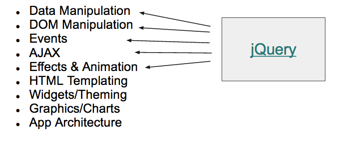

<style>
    .reveal .slides {
      zoom: 1 !important;
      height: auto !important;
    }
    .reveal .slides section {
      top: 50% !important;
      transform: translateY(-50%) !important;
      zoom: 0.75 !important;
    }
    .reveal pre {
        width: 100% !important;
    }
    .reveal section pre code {
        overflow: hidden !important;
        max-height: none !important;
        white-space: pre-wrap !important;
    }
    .reveal img{
        border: none !important;
        background: none !important;
    }
</style>


# Intro to jQuery

---

## Review:

### DOM & Data!

Our favorite Data Types

```
var myString = 'This is a string!'
var myInteger = 1
var myBoolean = true
var myArray = ['string', 1, myString, true]
var myObject = {
  name: 'Pamela',
  adjective: 'Cool',
  roles: ['hacker', 'teacher', 'coder']
}
```
					

---

## Review:

### DOM & Data!

Traversing the DOM with JavaScript

```
document.getElementById('presentation')
document.getElementsByClassName('future')
document.getElementsByTagName('body')
document.querySelectorAll('a')
document.querySelector('img')
```
					

---

## What's a library?

A collection of reusable methods for a particular purpose.

A math library might have functions like:

```
math.sum(array)
math.pow(num, num)
math.factorial(num)
```

---

## What's a library?

Include a script tag to the library on your page.

Call functions from that library

```
<body>
  <script src="https://cdnjs.cloudflare.com/ajax/libs/mathjs/3.11.4/math.js"></script>
  <script>
    var answer = math.sum(2, 2)
    alert(answer)
  </script>
</body>
```
				
---

## [Let's Develop It!](jquery/exercises/videoplayer_library)

---

## jQuery:

### the most popular library

Write less code for common tasks.

Abstract on top of cross-browser differences.

[](http://jquery.com/)

Open source, big community

---

## jQuery: Why?

No library:

```
var elems = document.getElementsByTagName('img')
for (var el of elems) {
	el.style.display = 'none'
}
```

jQuery:

```
$('img').hide()
```

shorter, cross-browser

---

## jQuery: Why?

No library:

```
var p = document.createElement('p')
p.appendChild(document.createTextNode('Welcome!'))
p.style.cssFloat = 'left'
p.style.backgroundColor = 'red'
p.className = 'special'
document.querySelector('div.header').appendChild(p)
```

jQuery:

```
var newP = $('Welcome!')
newP.css({'float': 'left', background-color': 'red'})
newP.addClass('special')
$('div.header').append(newP)
```
					

---

## jQuery:

### The Basics

Given this markup:

```
<p>Welcome to jQuery!</p>
```

Adding a class to the p is as simple as:

```
$('p').addClass('special')
```

The above yields:

```
<p class="special">Welcome to jQuery!</p>
```

shorter, cross-browser

---

## jQuery Recipe

### Select, Manipulate, Admire

Step 1: Select element(s)

```
$('p')
```
					
Step 2: Use a jQuery method to manipulate

```
$('p').addClass('special')
```

Step 3: Admire your results!

shorter, cross-browser

---

```
$('p').addClass('special')
```

`$` is the global jQuery object. Can also use “jQuery”.
								
```
$('p')
```

Finds DOM element(s) matching the given selector (in this case, all pragraphs). Returns a “jQuery collection.”

```
addClass('special')
```

Built-in jQuery method that adds the specified class to all elements in the collection.  

[Read the docs here.](http://api.jquery.com/addClass/)

---

## jQuery:

### Finding Elements

All CSS selectors are valid, plus more. [Read the docs.](http://api.jquery.com/category/selectors/)


```
<p>Welcome!</p>
```

```
$('p')
```

```
<div id="main">Welcome!</div>
```

```
$('#main')
```

```
<p class="intro">Welcome!</p>
```

```
$('.intro')
```

```
<div id="main">
  <p class="intro">Welcome!</p>
</div>
```

```
$('#main .intro')
```

shorter, cross-browser

---

## [Let's Develop It!](jquery/exercises/domaccess)

---

## jQuery:

### Reading Elements

If we start with this HTML...

```
<a id="yahoo" href="http://www.yahoo.com" style="font-size:20px">Yahoo!</a>
```

We can find it...

```
$('a#yahoo')
```

We can store it...

```
var myLink = $('a#yahoo')
```

---

## jQuery:

### Reading Elements

...And we can find out lots of things about it:

```
myLink.html()
```

→

```
'Yahoo!'
```

```
myLink.attr('href')
```

→

```
'http://www.yahoo.com'
```

```
myLink.css('font-size')
```

→

```
'20px'
```

shorter, cross-browser

---

## jQuery:

### Changing Elements

If we start with this HTML:

```
<a href="http://www.google.com">Google</a>
```

We can use this jQuery:

```
$('a').html('Yahoo!')
$('a').attr('href', 'http://www.yahoo.com')
$('a').css({'color': 'purple'})
```

And we'll get this:

```
<a href="http://www.yahoo.com" style="color:purple">Yahoo</a>
```

shorter, cross-browser

---

## jQuery Recipe:

### Create, Manipulate & Inject

Step 1: Create element and store a reference

```
var p = $('<p>')
```

Step 2: Use a method to manipulate (optional)

```
p.addClass('special')
```

Step 3: Inject into your HTML

```
$('body').append(p)
```

shorter, cross-browser

---

## jQuery:

### Create and Store

Pass in any HTML string and jQuery will create it and return it as a jQuery object.

```
$('<p>')
```

→

```
<p></p>
```

```
$('<p>Welcome!</p>')
```

→

```
<p>Welcome!</p>
```

Just like with the DOM API, we can store a reference to our new element in memory...

```
var myParagraph = $('<p class="intro">Welcome!</p>')
```

---

## jQuery:

### Manipulate

Now that we've stored a reference, we can make further revisions to our element.

```
var myParagraph = $('<p class="intro">Welcome!</p>')
```

```
myParagraph.css('font-size','4em')
```

---

## jQuery:

### Inject

Now, we can take our stored reference to ```myParagraph``` and inject it somewhere!

```
$('body').append(myParagraph)
```

```
$('body').prepend(myParagraph)
```

---

## Regular DOM nodes to jQuery objects

```
var paragraphs = $('p') // an array
```

```
var myParagraph = paragraphs[0] // a regular DOM node
```

```
var $myParagraph = $(paragraphs[0]) // a jQuery Object
```

We can also loop through our array...

```
for (var para of paragraphs) {
  var p = $(para)
  p.html(p.html() + ' wowee!!!!')
}
```

shorter, cross-browser

---

## jQuery:

### Including

[Download](http://jquery.com/download/) or link from an official CDN.

Then include using a `<script>` tag on the page.

```
<html>
<body>
  <h1>Hi!</h1>
  <script src="jquery.min.js"></script>
  <script>
  // Your code here
  </script>
</body>
</html>
```

shorter, cross-browser

---

## [Let's Develop It!](jquery/exercises/videoplayer_jquery)
