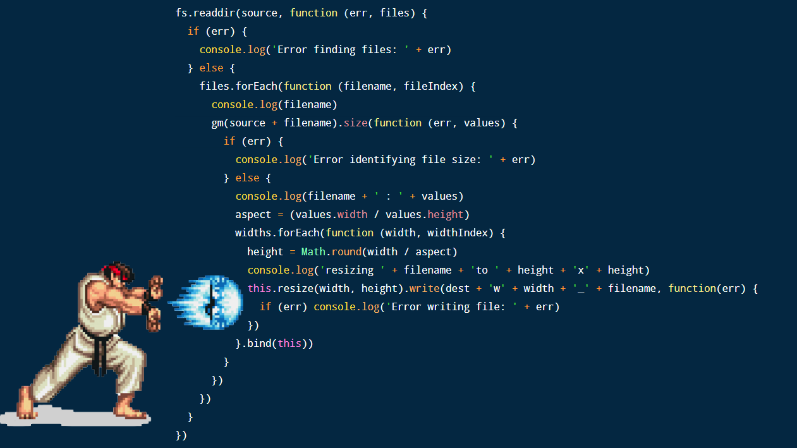

<style>
    .reveal .slides {
      zoom: 1 !important;
      height: auto !important;
    }
    .reveal .slides section {
      top: 50% !important;
      transform: translateY(-50%) !important;
      zoom: 0.75 !important;
    }
    .reveal pre {
        width: 100% !important;
    }
    .reveal section pre code {
        overflow: hidden !important;
        max-height: none !important;
        white-space: pre-wrap !important;
    }
    .reveal img {
        border: none !important;
        background: none !important;
    }
</style>


# Promises

---

## JS Callbacks

So far, we've used callbacks to handle cases where we want to do something when a task finishes, but we don't want other code to wait. 

```js
let img1 = document.querySelector('.img-1')

img1.addEventListener('load', function() {
  // woo yey image loaded
})

img1.addEventListener('error', function() {
  // argh everything's broken
})
```

However, one disadvantage of this pattern is that it's possible that one of the events has already happened _before_ we added the event listener.
---

## JS Callbacks

We can get around the problem using a property of images called _complete_

```js
let img1 = document.querySelector('.img-1')

function loaded() {
  // woo yey image loaded
}

if (img1.complete) { // If already loaded, call the callback immediately
  loaded()
}
else {
  img1.addEventListener('load', loaded)
}

img1.addEventListener('error', function() {
  // argh everything's broken
})
```

This doesn't catch images that error'd before we got a chance to listen for them unfortunately the DOM doesn't give us a way to do that.

Also, this is loading one image, things get even more complex if we want to know when a set of images have loaded.

---

## Nested Callbacks

What if we want to perform a chain of async actions, ensuring a specific order? One way is to nest callbacks, like this:

```js
doSomething(function(result) {
  doSomethingElse(result, function(newResult) {
    doThirdThing(newResult, function(finalResult) {
      console.log('Got the final result: ' + finalResult)
    }, failureCallback)
  }, failureCallback)
}, failureCallback)
```

However, even this simple example is not at all DRY, and will quickly become unmaintainable.

Taken to the extreme, this type of nesting gives rise to ...

---

## Callback Hell



So how do we fix this?

---

## Promises

Events are great for things that can happen multiple times on the same object — keyup, touchstart, click, etc. With those events you don't really care about what happened before you attached the listener.

But when it comes to async success/failure, ideally you want something like this:

```js
img1.callThisIfLoadedOrWhenLoaded(function() {
  // loaded
}).orIfFailedCallThis(function() {
  // failed
})

// and…
whenAllTheseHaveLoaded([img1, img2]).callThis(function() {
  // all loaded
}).orIfSomeFailedCallThis(function() {
  // one or more failed
})
```

---

## Promises

This is what promises do, but with better naming. If HTML image elements had a "ready" method that returned a promise, we could do this:

```js
img1.ready().then(function() {
  // loaded
}, function() {
  // failed
})

// and…
Promise.all([img1.ready(), img2.ready()]).then(function() {
  // all loaded
}, function() {
  // one or more failed
})
```

The basic idea is that we attach our callbacks to a Promise _object_ that is returned by an async function, rather than _passing_ the callback as a parameter.

---

## Promise Object

```js
img1.ready().then(function() {
  // loaded
}, function() {
  // failed
})

// and…
Promise.all([img1.ready(), img2.ready()]).then(function() {
  // all loaded
}, function() {
  // one or more failed
})
```

* The ready() function returns a Promise object
* The then() function attaches two callbacks to the promise - one for success, one for failure
* Promise.all will only invoke the then() callback when all promises in the array resolve. The order they resolve in is irrelevant

---

## Promises

At their most basic, promises are a bit like event listeners except:

> * A promise can only succeed or fail once. It cannot succeed or fail twice, neither can it switch from success to failure or vice versa.
* If a promise has succeeded or failed and you later add a success/failure callback, the correct callback will be called, even though the event took place earlier.

This is extremely useful for async success/failure, because you're less interested in the exact time something became available, and more interested in reacting to the outcome.

---

## Promises

A promise can be in one of 3 states:

* **fulfilled** - The action relating to the promise succeeded
* **rejected** - The action relating to the promise failed
* **pending** - The action is still in progress

---

## Example

Let's have a look at a real-world use of promises by getting some random user data from a public API

```js
fetch('https://randomuser.me/api')
    .then(
        (res) => res.json(),
        () => console.error('Unable to fetch!')
    )
    .then((json) => console.log(json))
```

fetch() returns a Promise. If it resolves successfully, then the first callback in the then() is executed, which parses the result as JSON.

The json() method itself returns a promise, which we process in the chained then().

If an error occurs in fetch() then the second callback in the then() is executed, and the chained then() is NOT executed.

---

## Let's Develop It!

Investigate the navigator.mediaDevices API, which is built in to most browsers.

Write a basic HTML page and add script that retrieves and displays a list of media devices on your laptop, using methods found in navigator.mediaDevices.

---

## Creating a promise

In addition to using existing promises, we can create our own.

```js
let myPromise = new Promise(function(resolve, reject) {
  // do a thing, possibly async, then…

  if (/* everything turned out fine */) {
    resolve("Stuff worked!")
  }
  else {
    reject(Error("It broke"))
  }
})
```

The promise constructor takes one argument: a callback with two parameters, resolve and reject.

Basic pattern is to do something within the callback, perhaps async, then call resolve if everything worked, otherwise call reject.

Like throw in plain old JavaScript, it's customary, but not required, to reject with an Error object. The benefit of Error objects is they capture a stack trace, making debugging tools more helpful.

---

## Using our promise

Now we've built the promise, we can use it like this:

```js
promise.then(function(result) {
  console.log(result) // "Stuff worked!"
}, function(err) {
  console.log(err) // Error: "It broke"
})
```

then() takes two arguments, a callback for a success case, and another for the failure case. Both are optional, so you can add a callback for the success or failure case only.

In this case, we're just displaying the result on the console, but in a real app, we could do anything we like with the response.

---

## Catch block

If we have a chain of then(), we can create a function that catches any and all errors that occur anywhere in the chain.

```js
fetch('https://randomuser.me/api')
    .then(
      (res) => res.json()
    )
    .then(
      (json) => console.log(json)
    )
    .catch(
      (err) => console.error('Unable to fetch!', Error(err))
    )
```

Note that we don't need the second callback in each then(), because the catch() will trap any errors raised by the fetch()

---

## Let's develop it

Write a function testNum that takes a number as an argument and returns a Promise that tests if the value is less than or greater than the value 10.

The promise should resolve if the value is less than 10, or reject with an error otherwise.

Write two blocks of code to test the promise - one that passes a value less than 10 (to test error handling), and one that passes a value greater than 10.

---

## Resources

[Google Developers primer on promises](https://developers.google.com/web/fundamentals/primers/promises)

[Official promises reference](https://developer.mozilla.org/en-US/docs/Web/JavaScript/Reference/Global_Objects/Promise)

[More comprehensive promises tutorial](http://www.javascriptkit.com/javatutors/javascriptpromises.shtml)


---

# Questions?

---

## AFTERNOON CHALLENGE

### [Canvas Unit: Promises](https://coderacademy.instructure.com/courses/144/pages/unit-promises)

